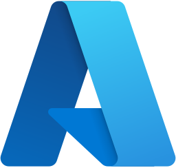
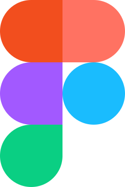
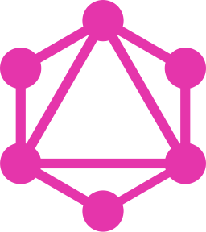
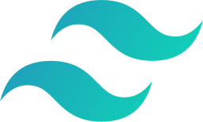
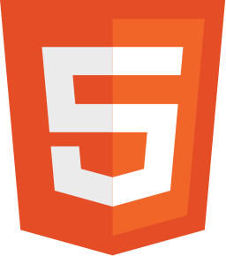
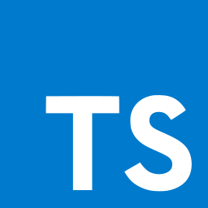
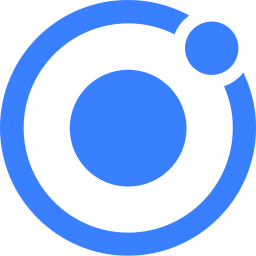

## Hi , I'm **Ritesh 👋**

🚀 Front-End Lead with over 15+ years of experience in crafting visually stunning and user-friendly web applications.

I specialize in HTML, CSS, JavaScript, and modern front-end frameworks like React, Angular, and Next.js. My passion lies in leading and mentoring developers, fostering collaboration, and delivering high-quality projects that exceed expectations.

I thrive on tackling new challenges and continuously improving my skills to stay ahead in the ever-evolving tech landscape. Let's connect and build something amazing together!

## ℹ️ Find more about me at

## 🌱 I’m currently working on my skills

These are some of the technologies I'm experienced with and enjoy working with.  I've used them in various projects, and I'm always eager to learn more.

  
  
  
  
  
  
  
  
  
  

<!---
ritsrivastava01/ritsrivastava01 is a ✨ special ✨ repository because its `README.md` (this file) appears on your GitHub profile.
You can click the Preview link to take a look at your changes.
--->
